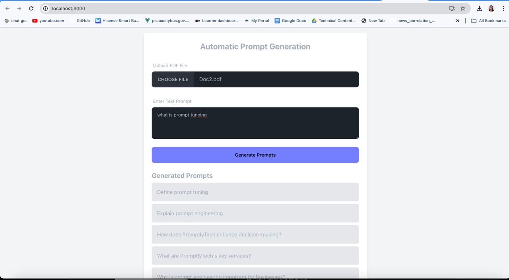

LLM Prompt Engine

This repository contains the source code for an AI-driven prompt generation and evaluation system, designed to optimize the use of Language Models (LLMs) in various industries. The project consists of both frontend and backend components, facilitating prompt generation, automatic evaluation data generation, and prompt testing.

Objective:

Automatic Prompt Generation Service:
This service streamlines the process of creating effective prompts, enabling businesses to efficiently utilize LLMs for generating high-quality, relevant content. It significantly reduces the time and expertise required in crafting prompts manually.

Automatic Evaluation Data Generation Service:
PromptlyTech’s service automates the generation of diverse test cases, ensuring comprehensive coverage and identifying potential issues. This enhances the reliability and performance of LLM applications, saving significant time in the QA (Quality Assurance) process.

Prompt Testing and Ranking Service:
PromptlyTech’s service evaluates and ranks different prompts based on effectiveness, helping users to get the desired outcome from LLM. It ensures that chatbots and virtual assistants provide accurate, contextually relevant responses, thereby improving user engagement and satisfaction.

Folder Structure:

LLM_Prompt_Engine/
|_ backend/
   |_ tests/
   |  |_ test_evaluation_data_generation.py
   |  |_ test_prompt_generation.py
   |  |_ test_prompt_testing.py
   |_ utils/
   |  |_ langchain.py
   |  |_ pdf_utils.py
   |  |_ text_splitter_utils.py
   |  |_ vector_store_utils.py
   |_ app.py
   |_ config.py
   |_ requirements.txt
|_ frontend/
   |_ src/
   |  |_ components/
   |     |_ chatbox.js
   |_ app.js
   |_ index.js
   |_ index.css
   |_ package-lock.json
   |_ package.json
   |_ README.md
   |_ tailwind.config.js
|_ .gitignore
|_ License
|_ README.md

Backend:

The backend directory contains the Flask API and utility files for prompt generation and evaluation.
tests/: Directory for backend test files.
utils/: Utility files for prompt generation and processing.
app.py: Flask application for handling API requests.
config.py: Configuration settings for the backend.
requirements.txt: List of Python dependencies. Install using pip install -r requirements.txt.
Frontend:

The frontend directory contains React components and configuration files.
src/: Source directory for React components.
components/: Directory for React components, including the chatbox component.
app.js, index.js, index.css: Main application files.
package-lock.json, package.json: NPM package files.
README.md: Readme file for the frontend.
Other Files:

.gitignore: Gitignore file to exclude certain files from version control.
License: License file for the project.
README.md: Main readme file for the project.
Usage:

Clone the repository.
Navigate to the backend directory and install dependencies using pip install -r requirements.txt.
Run the backend server using python app.py.
Navigate to the frontend directory and install dependencies using npm install.
Start the frontend application using npm start.
Access the application at http://localhost:3000 in your web browser.
License:
This project is licensed under the MIT License.

Contributing:
Contributions are welcome! Please follow the Contributing Guidelines.

